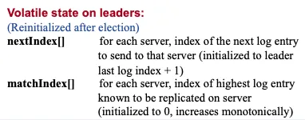

### 1.Progress结构体

raft论文中指出，leader需要保存额外的易失性状态，用于追踪fowller的复制状态：


> 

|      参数      |                        解释                        |
|:------------:|:------------------------------------------------:|
| nextIndex[]  | 对于每一台服务器，发送到该服务器的下一个日志条目的索引（初始值为领导人最后的日志条目的索引+1） |
| matchIndex[] |   对于每一台服务器，已知的已经复制到该服务器的最高日志条目的索引（初始值为0，单调递增）    |

在etcd中，leader维护了一个follower id到Progress对象的映射，leader用它来追踪所有fowller的状态。
其对raft论文中所提及的leader需要保存的额外状态进行了拓展
，主要功能及其字段描述如下：

- 追踪follower的日志复制进度

|           字段           |                                                                    解释                                                                     |
|:----------------------:|:-----------------------------------------------------------------------------------------------------------------------------------------:|
|      Match uint64      |                                                          追随者的日志与领导者的日志相匹配的位置的索引                                                           |   
|      Next uint64       |                                                           发送给follower的下一条日志的索引                                                            |  
|   sentCommit uint64    |                         sentCommit 是发送给跟随者的最高提交索引。<br/>通常，它是单调的，但在某些情况下会出现倒退，例如当State转换为 `StateProbe` 或收到跟随者的拒绝时。                         |   
| PendingSnapshot uint64 | 当领导者意识到这个节点需要一个快照时候，用于跟踪最新日志的index。 当有待处理的快照时，向跟随者的复制将暂停。  如果领导者从其收到 MsgAppResp（当跟随者应用快照时会发出这样的 MsgAppResp)，follwer的状态转换为`StateReplicate` |  

- 限流

|          字段           |                                                                                                    解释                                                                                                    |
|:---------------------:|:--------------------------------------------------------------------------------------------------------------------------------------------------------------------------------------------------------:|
| Inflights *Inflights  | Inflights是正在发送的消息的滑动窗口,每一个滑动窗口包含一个或多个日志。<br/>当领导者发出消息时，最后一个条目的索引应该添加到 inflights 中。<br/>当领导者收到回复时，应该通过使用最后收到的条目的索引调用 inflights.FreeLE 来释放先前的 inflights。<br/>inflight 有效地限制了发送中消息的数量，以及每个 Progress 可以使用的带宽 |   
| MsgAppFlowPaused bool |                                                  当发送给该节点的 MsgApp 流受到限制时，将 MsgAppFlowPaused转换为true。这种情况发生在 StateProbe 或 Inflights 饱和的 StateReplicate 中。                                                   | 

- 追踪follower的状态

|        字段         |                                                                                                 解释                                                                                                 |
|:-----------------:|:--------------------------------------------------------------------------------------------------------------------------------------------------------------------------------------------------:|
|  State StateType  | 	在StateProbe中，leader每个心跳间隔最多发送一条复制消息,用于探讨了追随者的实际进展。<br/>在StateReplicate中，leader乐观地增加next到发送Replicate消息时发送的最新条目之后。这是一种优化状态，用于将日志条目快速复制到follower。<br/>在StateSnapshot中，leader之前应该已经发送了快照，并停止发送任何复制消息。 |   
| RecentActive bool |                                                                                  如果节点最近处于活动状态，则 RecentActive 为真。                                                                                   | 

Processer的状态转换如图2所示。

```
                            +--------------------------------------------------------+          
                            |                  send snapshot                         |          
                            |                                                        |          
                  +---------+----------+                                  +----------v---------+
              +--->       probe        |                                  |      snapshot      |
              |   |  max inflight = 1  <----------------------------------+  max inflight = 0  |
              |   +---------+----------+                                  +--------------------+
              |             |            1. snapshot success                                    
              |             |               (next=snapshot.index + 1)                           
              |             |            2. snapshot failure                                    
              |             |               (no change)                                         
              |             |            3. receives msgAppResp(rej=false&&index>lastsnap.index)
              |             |               (match=m.index,next=match+1)                        
receives msgAppResp         |
(next=match+1)(rej=true)    |                                                                  
              |             |                                                                   
              |             |                                                                   
              |             |                                                                   
              |             |   receives msgAppResp(rej=false&&index>match)                     
              |             |   (match=m.index,next=match+1)                                    
              |             |                                                                   
              |             |                                                                   
              |             |                                                                   
              |   +---------v----------+                                                        
              |   |     replicate      |                                                        
              +---+  max inflight = n  |                                                        
                  +--------------------+                                                        
```

<div style="text-align: center;"> 图2.Progress状态转换图  </div>

接下来看几个重要的方法

|                     方法名                      |                                      解释                                       |
|:--------------------------------------------:|:-----------------------------------------------------------------------------:|
|                      函数                      |                                      解释                                       |
|         ResetState(state StateType)          |       将Progress的状态重制为`state`<br/>重新设置与`限流`相关的字段<br/>PendingSnapshot标记为0       |
|                BecomeProbe()                 |                将Progress的状态重制为`StateProbe`,根据重置之前的状态来设置Next字段                 |
|              BecomeReplicate()               |                 将Progress的状态重制为`StateProbe`，将Next字段设置为March+1                 |
|       BecomeSnapshot(snapshoti uint64)       |                        将Progress的状态重制为`StateSnapshot`                         |
|    SentEntries(entries int, bytes uint64)    |               将需要发送的日志添加到Inflights中，更新Next字段和MsgAppFlowPaused字段               |
|       CanBumpCommit(index uint64) bool       |                                  是否允许急切地发送索引                                  |
|          MaybeUpdate(n uint64) bool          |   当接收者返回MsgAppResp时调用该函数。如果是过期的msg，也就是n <= pr.Match，返回false，否则，更新Match和Next   |
| MaybeDecrTo(rejected, matchHint uint64) bool | 当接收者返回拒绝时调用该函数。如果是过期的msg，也就是rejected <= pr.Match，返回false，否则，更新Next和sentCommit |

### 2.raftlog结构体

#### 2.1 unstable结构体

```
-------------------------------------------------
|    0     |     1     |     2     |      3     |
| u.offset |u.offset+1 |u.offset+2 | u.offset+3 |
-------------------------------------------------
```

|           字段            |                                        解释                                        |
|:-----------------------:|:--------------------------------------------------------------------------------:|
|  snapshot *pb.Snapshot  |                                     传入的不稳定快照                                     |
|   entries []pb.Entry    |                                  所有尚未写入稳定存储的条目                                   |
|      offset uint64      |                           entry[i] 的raft日志位置为i+offset。                           |
| snapshotInProgress bool |                                 如果为真，则快照正在写入存储。                                  |
| offsetInProgress uint64 | entities[:offsetInProgress-offset] 正在写入存储。<br/> offset <= offsetInProgress 总是成立的 |

|                 方法                 |                         解释                          |
|:----------------------------------:|:---------------------------------------------------:|
|  maybeFirstIndex() (uint64, bool)  |            返回日第一条日志的索引：如果有快照，返回其index+1             |
|  maybeLastIndex() (uint64, bool)   |                 如果至少有一条日志，返回其index                  |
| maybeTerm(i uint64) (uint64, bool) |                存在index为i的日志，返回其Term                 |
|      nextEntries() []pb.Entry      | 返回下一条需要写入稳定存储的日志，entities[offsetInProgress-offset：] |
|    nextSnapshot() *pb.Snapshot     |                  返回一下个需要写入稳定存储的日志                   |

#### 2.2 Storage结构体

### 2.Config结构体

